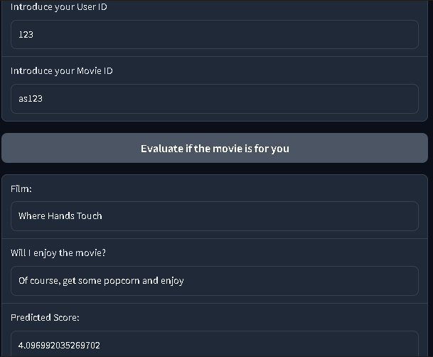

# **Individual Project - Machine Learning Operations (MLOps)**

_Engineer: Paulo C. Suclly A._

## **Explanatory Video**
[Click Here To Access The Video](https://youtu.be/rLUn2rhO37s)

## **Content Of The Project**

- **PI_1_ETL.ipynb**
  - ETL Process
- **PI_1_Queries.ipynb**
  - Queries Used In The API
- **PI_1_EDA.ipynb**
  - Exploratory Data Analysis-EDA
- **PI_1_ML.ipynb**
  - Machine Learning Process
- **main.py**
  - API Code
- **app.py**
  - ML Deployment Code
- **platform_movies_scores.csv**
  - CSV Used For ETL
- **scores.csv**
  - CSV Used For ML
- **README.md**
  - Explanatory Summary Of The Project
- **requirements.txt**
  - Required API Dependencies

# **API**

 

API made with Fast Api [Click Here To Access To The API Page](https://deta.space/discovery/r/fyvwyqserou4quqw)

## **Functions Of The API**

### **1.- get_max_duration(year, platform, duration_type) -> Optional Parameters**

  Will return the movie with the longest duration.
  - Example: get_max_duration()
    - Output: "soothing surf at del norte for sleep black screen"

 

### **2.- get_score_count(platform, scored, year)**

  Will return the number of films by platform with a score greater than XX in a given year.
  - Example: get_max_duration("Amazon",3.5,2010)
    - Output: 134

 

### **3.- get_count_platform(platform)**

  Will return the amount of movies that the platform has.
  - Example: get_count_platform("Netflix")
    - Output: 8807

 

### **4.- get_actor(platform, year)**

  Will return the name of the actor who had the most appearances in that year.
  - Example: get_actor("Netflix",2020)
    - Output: "michela luci, jamie watson, eric peterson, anna claire bartlam, nicolas aqui, cory doran, julie lemieux, derek mcgrath"  

 

  
  **Considerations:** 

      Project must be downloaded from Canvas in order to use it (You have to be registered to access).
      Allowed Platforms -> Netflix, Amazon, Disney, Hulu.
      Allowed Duration_Type -> min, season, seasons.
      For a better visualization access to the route "/docs".

# **Machine Learning - Recommendation Movie Model**

### A Recommendation Movie Model was trained using SVD from scikit-surprise library. The trained model was included into an interface, where you will be able to try it.

#### [Click Here To Access To The Graphic Interface](https://huggingface.co/spaces/paulox30/PI_MLOps)

Here is an image of the interface.

The way to use it is easy and is summarized in 3 steps:

1. Introduce your User Id (Numeric Format).
2. Introduce the Movie Id (Text Format).
3. Click on the button "Evaluate if the movie is for you" and enjoy.

### **Final Notes**

Thank you for trying this project. 
All feedback will be very welcome, thank you very much.
 
Contact Info:
  - Email: paulo.suclly@pucp.edu.pe
